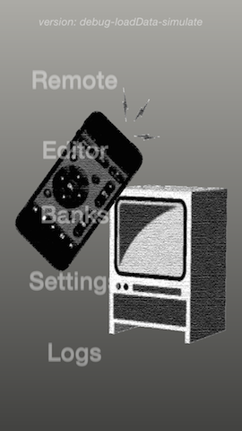
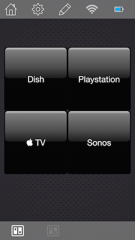
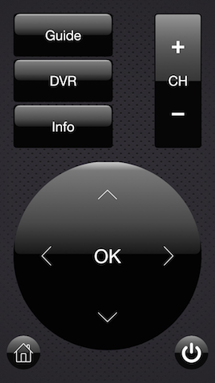
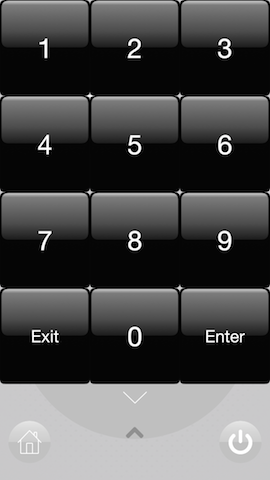
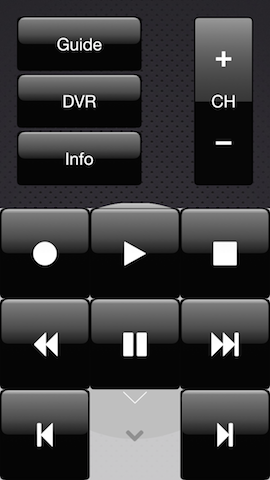
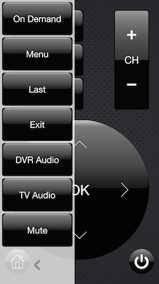
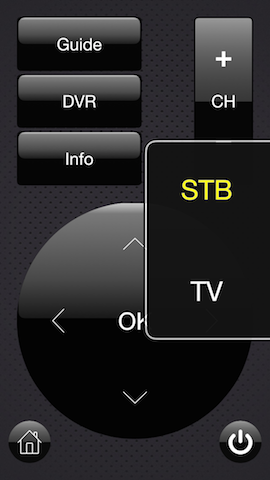
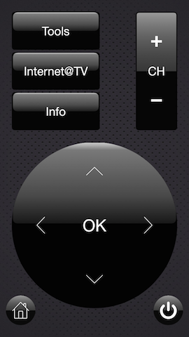

Remote
======

Exploring the app
-----------------

The app has been stripped down to what I have gotten back into working order so far. Only the 'Remote' button in the main menu is enabled.

Pressing the 'Remote' button takes you to the 'Home' or 'Activities' remote. Only the 'Dish' activity has been left configured and the top bar buttons have been disabled accept for the top left button that leads back to the launch screen.

Pressing the 'Dish' button will launch the activity and switch to the 'Dish' remote in 'Default' mode.

The 'Rocker' at top right maintains a collection of command sets that can be changed out by panning/swiping left or right across the label (CH, VOL, PAGE). All commands should be simulated and won't crash the app so long as the scheme's commandline arguments are left as follows:

-	-loadData YES // or you won't get a remote
-	-simulate YES // or you will actually try to connect over wifi to a device you don't have

There are four panels configured to slide out from top, bottom, left, and right. I am not terribly happy with their gestures at the moment and have intended to replace the gestures with the tilting of the device to slide them in and out. As it is, view the remote as being composed of four quadrants corresponding to the panels.

Swiping in the top half of the screen from top to bottom reveals the numberpad.

The non-intuitive part I am not happy with is that hiding it requires swiping down to up still using the top half of the screen. The easier method is to touch the semi-transparent cheveron button to tuck the panel containing it. The same process can be used to show/hide…

the transport at the bottom,

the addional left buttons on, well, the left,

and the mode selection panel on the right.

In the mode selection panel you should find that 'STB' is highlighted as it is the default mode for this remote. Touching the 'TV' button will switch the remote into a different mode configured to send different commands using the same layout. This being my custom setup, I had been using the default mode for the cable dvr and tv mode to get access to extra commands for controlling my tv directly.

The buttom left 'Home' button of the 'Dish' remote takes you back to the 'Home/Activities' remote.

The entire application requires autolayout. Each `RemoteElementView` in the remote has a corresponding `RemoteElement` model with a to-many relationship for the `Constraint` model. When the views initialize themselves from their model, these model constraints are turned into real `NSLayoutConstraint` objects (or rather a subclass of `NSLayoutConstraint` that uses context change notifications and key-value observing to stay in sync with the constraint model) which are attached to the corresponding view of the model that owns the constraint.

How the Remotes are Generated
-----------------------------

The 'CoreData' folder contains the json files used to create the remote. I stripped this down to essentials.

The json files use an extended syntax make them more human readable. Comments are allowed via // single-line comment and /\* multi-line comment \*/. In addition, to cut down on the number of braces, when an object has only a single entry it can be collapsed into a keypath:

		"background-image": {
			"default": {
				"uuid": "089D4A98-E7C1-472A-A0A3-30258BE42388"
			}
		}

becomes

		"background-image.default.uuid": "089D4A98-E7C1-472A-A0A3-30258BE42388"

These json files are parsed by `MSJSONSerialization` and `MSJSONParser`, which convert the extended json into json that `NSJSONSerialization` will be happy with. This same process is reveresed on export. As a test I have been exporting various elements after import so you should find some json files in the 'Documents' directory of the application after import.

Both processes use `Foundation` Class extensions to let various objects know how to turn themselves into valid JSON objects, as well as, the `NSLayoutConstraint` category which knows how to turn data like this…

		"constraints": {
          "index": {
            "homeAndPowerButtons": "D393B9CC-1FCD-4534-BDFB-500785C54951",
            "homeButton": "B7E67B31-F34E-486B-A71C-01A010E1AA1E",
            "powerOffAndExitActivity": "C5DA280D-924A-4AEC-BCA9-B68EF31658DF"
          },
          "format": [
            "homeAndPowerButtons.height = 50",
            "homeAndPowerButtons.width = 300",
            "homeButton.centerY = homeAndPowerButtons.centerY",
            "homeButton.left = homeAndPowerButtons.left",
            "powerOffAndExitActivity.centerY = homeAndPowerButtons.centerY",
            "powerOffAndExitActivity.right = homeAndPowerButtons.right"
          ]
        }
    }

into `Constraint` model objects and then back into the data on export.

I am sure I did not touch on half the stuff I extended so if navigating in Xcode between the `Remote` code and companion `MSKit` code does not make something clear, just holler at me.

